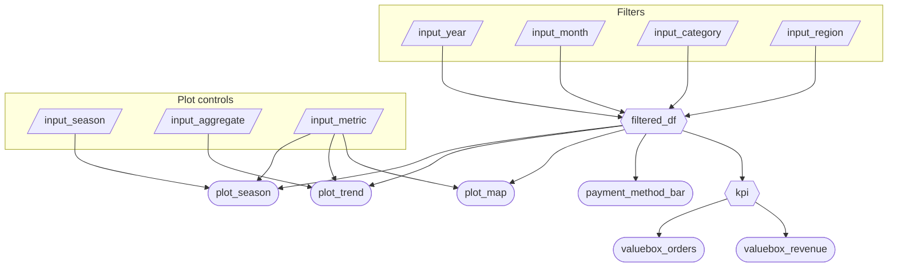

## 2.1 Updated Job Stories

After implementing the reactive structure in Phase 2, we revisited our original job stories to ensure alignment between intended functionality and the implemented design. While the primary user goals remain the same, some interaction details were refined during development.

| \# | Job Story | Status | Notes |
|----------------|------------------------|-----------------|----------------|
| 1 | As an inventory manager, I want to see **Quantity Sold for a specific season** so I don’t overstock or understock. | Implemented | Implemented using `input_season`, `input_month`, and metric selector. Season comparison now controlled by a toggle switch. |
| 2 | As a logistics lead, I want to filter sales by **Region** so I can put inventory closer to the customers who buy it. | Implemented | Region filter implemented using checkbox group (`input_region`) instead of selectize for better visibility. |
| 3 | As a strategy director, I want to see the **Total Sales trend over several years** so I can identify which products are actually growing. | Implemented | Implemented using year slider (`input_year`) and main trend plot. Trend updates reactively based on selected metric and filters. |

## 2.2 Component Inventory

### Inputs

The following inputs allow users to filter the dataset by time, category, region, and metric selection. These inputs drive all downstream reactive calculations.

| ID              | Type  | Shiny widget / renderer     | Depends on | Job Story |
|-----------------|-------|-----------------------------|------------|-----------|
| input_year      | Input | `ui.input_slider()`         | —          | #3        |
| input_month     | Input | `ui.input_selectize()`      | —          | #1        |
| input_category  | Input | `ui.input_selectize()`      | —          | #3        |
| input_region    | Input | `ui.input_checkbox_group()` | —          | #2        |
| input_metric    | Input | `ui.input_radio_buttons()`  | —          | #1, #3    |
| input_aggregate | Input | `ui.input_switch()`         | —          | #3        |
| input_season    | Input | `ui.input_switch()`         | —          | #1        |

------------------------------------------------------------------------

### Reactive Calculations

Reactive calculations centralize data transformation logic to ensure efficient updates. The `filtered_df` reactive expression serves as the primary data source for multiple outputs.

| ID | Type | Shiny widget / renderer | Depends on | Job Story |
|------------|------------|-------------------------|------------|------------|
| filtered_df | Reactive calc | `@reactive.calc` | `input_year`, `input_month`, `input_category`, `input_region` | #1, #2, #3 |
| kpi | Reactive calc | `@reactive.calc` | `filtered_df` | #3 |

------------------------------------------------------------------------

### Outputs

The following outputs consume reactive calculations and update dynamically based on user input changes.

| ID | Type | Shiny widget / renderer | Depends on | Job Story |
|------------|------------|-------------------------|------------|------------|
| valuebox_revenue | Output | `@render.text` | `kpi` | #3 |
| valuebox_orders | Output | `@render.text` | `kpi` | #3 |
| plot_trend | Output | `@render.plot` | `filtered_df`, `input_metric`, `input_aggregate` | #3 |
| plot_map | Output | `@render.plot` | `filtered_df`, `input_metric` | #2 |
| plot_season | Output | `@render.plot` | `filtered_df`, `input_metric`, `input_season` | #1 |
| payment_method_bar | Output | `@render.plot` | `filtered_df` | #3 |

## 2.3 Reactivity Diagram

## 2.4 Calculation Details

### 1. filtered_df

- Inputs it depends on: `input_year` (year), `input_month` (month), `input_category` (product category), and `input_region` (customer region).
- Transformation: Filters the original dataset to retain only rows that match the selected year(s), month(s), product category(ies), and customer region(s).
- Outputs: `plot_map`, `plot_trend`, `plot_season`, `payment_method_bar`, and `kpi`.

### 2. kpi

- Inputs it depends on: `filtered_df`.
- Transformation: Computes aggregated summary statistics (e.g., total revenue and total number of orders) based on the filtered dataset.
- Outputs: `valuebox_revenue` (total revenue) and `valuebox_orders` (total number of orders).